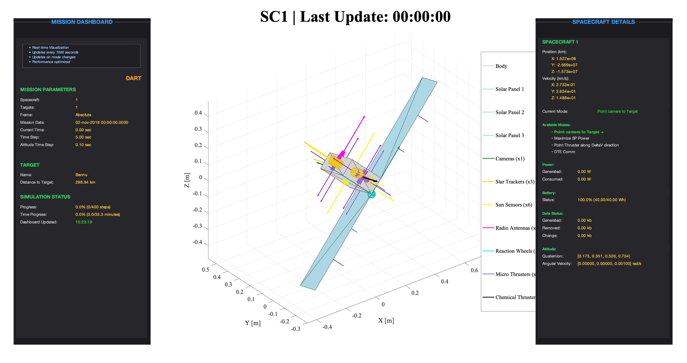
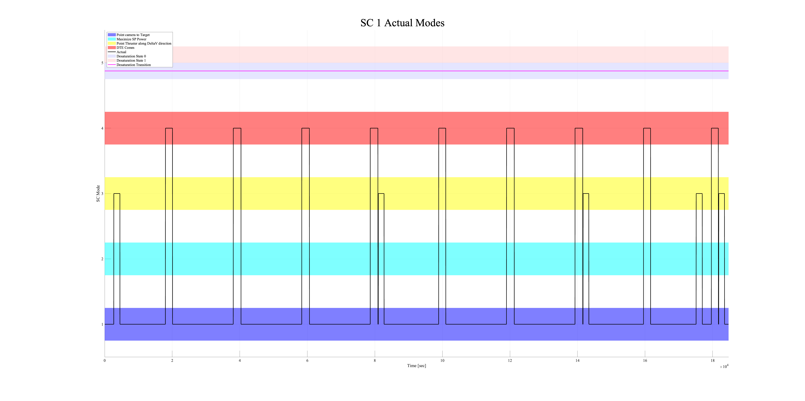
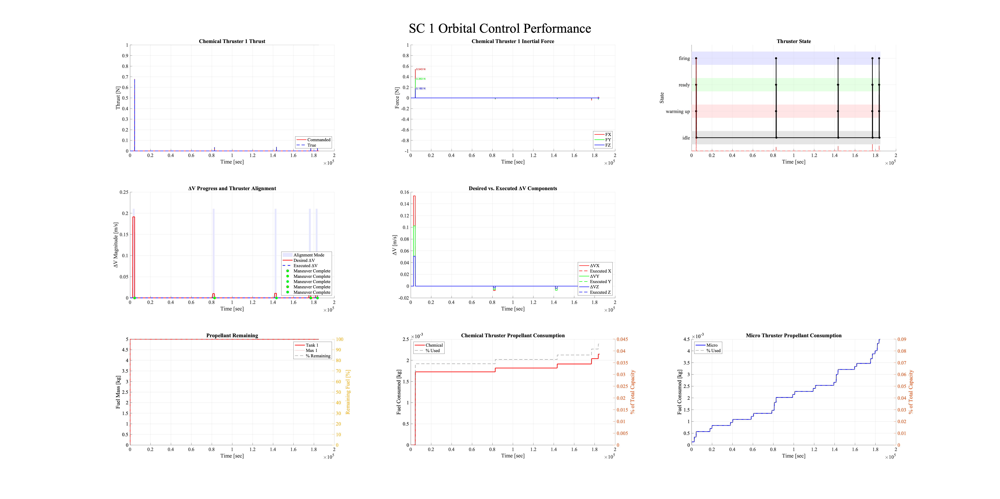
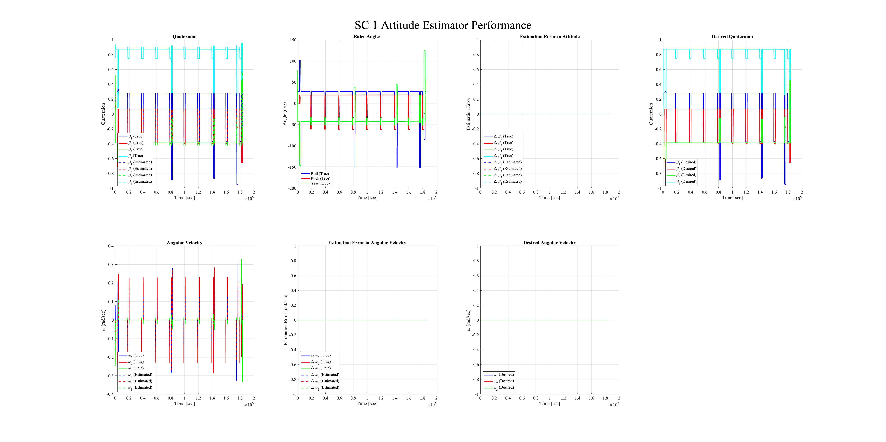
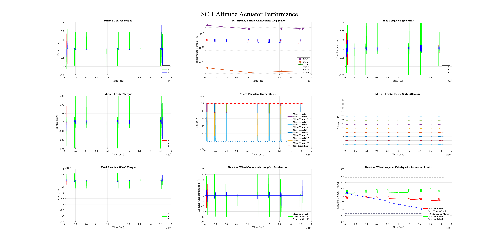
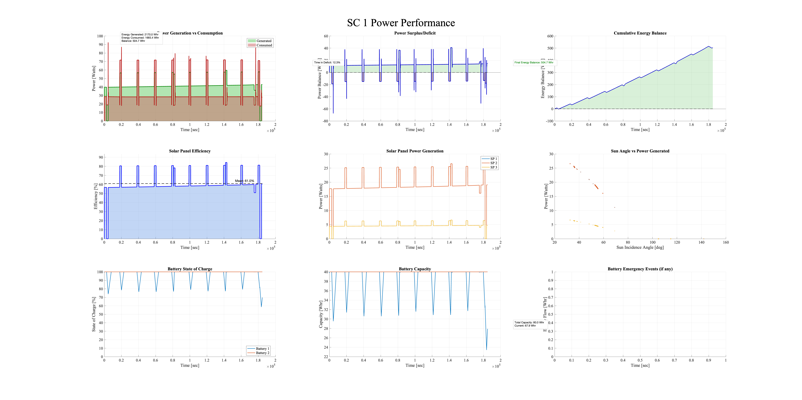
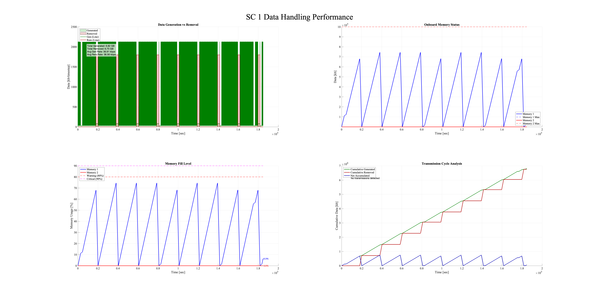
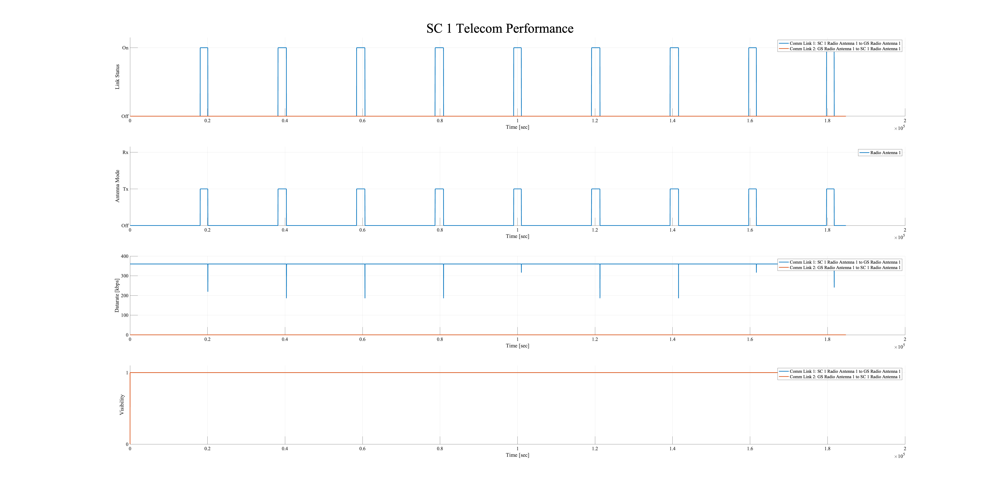
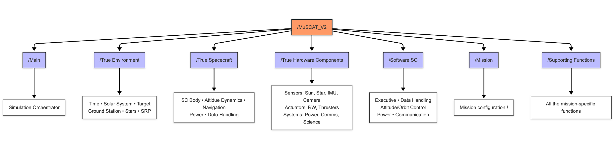

# Multi-Spacecraft Concept and Autonomy Tool (MuSCAT) 

> "MuSCAT shines in rapid early-phase evaluation of autonomous mission concepts."

---

## 🚀 Overview

Multi-Spacecraft Concept and Autonomy Tool (MuSCAT) is an open-source simulation software offering an integrated platform for conducting low-fidelity simulations of spacecraft mission concepts and testing autonomy algorithms. Whether designing single or multiple spacecraft missions, MuSCAT provides comprehensive simulation capabilities for both cruising and orbiting spacecraft.

MuSCAT employs a dual-loop architecture that efficiently handles different timescales for spacecraft dynamics, allowing for accurate simulation of both fast-changing attitude dynamics and slower-evolving orbital mechanics in a computationally efficient manner.

### Key Subsystems

MuSCAT encompasses various spacecraft subsystems including:

- **Navigation** - Trajectory planning and orbital mechanics
- **Attitude Determination and Control** - Spacecraft orientation and stabilization
- **Power Management** - Solar panels, batteries, and power distribution
- **Data Handling** - Onboard computing and memory management
- **Communication** - Direct-to-Earth and inter-spacecraft connectivity
- **Scientific Instruments** - Simulation of various science payloads

It provides mission designers with a quantitative framework to verify if mission concepts meet level-1 science functional requirements.

---

## 📑 Table of Contents

- [Documentation](#-documentation)
- [Contact](#-contact)
- [Installation Instructions](#-installation-instructions)
- [Simulation Results](#-simulation-results)
- [Code Organization & Structure](#-code-organization--structure)
- [Core Architecture](#-core-architecture)
- [Contributors](#-contributors)
- [Repository Statistics](#-repository-statistics)

---

## 📚 Documentation

For comprehensive information about MuSCAT, please explore the `/Documentation` folder where you'll find detailed documentation in PDF format. The documentation is organized into three chapters:

1. **Introduction & Architecture** - Overview of MuSCAT's design and capabilities
2. **How to Implement a Mission** - Step-by-step guide to creating your own mission simulations
3. **Code Generated Documentation** - Technical reference for MuSCAT's components and functions

Also see paper: S. Bandyopadhyay, Y. Kumar Nakka, L. Fesq, S. Ardito, "Design and Development of MuSCAT: Multi-Spacecraft Concept and Autonomy Tool," AIAA Accelerating Space Commerce, Exploration, and New Discovery (ASCEND), 2024. ([DOI](https://doi.org/10.2514/6.2024-4805))

---

##  📨 Contact

This software is developed and maintained by:

**Saptarshi Bandyopadhyay**  
Robotics Technologist  
NASA Jet Propulsion Laboratory  
California Institute of Technology  
Pasadena, CA, USA 

Please mail `Saptarshi.Bandyopadhyay@jpl.nasa.gov` if you face any issues. 

---

## 🔧 Installation Instructions

### Step 1 

Git clone the repo into your desired folder. Let's say it is `XYZ >`

```bash
git clone https://github.com/nasa/muscat.git
```

Then the `muscat` folder is accessed using `XYZ > muscat`

### Step 2 

Ensure that `MuSCAT_Supporting_Files` is in the same parent folder. You can download it from [here](https://www.dropbox.com/s/qokkcj6sn802n7p/MuSCAT_Supporting_Files.zip?dl=0) 

Then the `MuSCAT_Supporting_Files` folder is accessed using `XYZ > MuSCAT_Supporting_Files`

Ensure that you see the following folders inside `MuSCAT_Supporting_Files` folder:
- `SC_data` - Spacecraft-specific data including SPICE trajectory files
- `SB_data` - Small body data for asteroid/comet missions
- `Science_points` - Target points for scientific observations
- `SPICE` - NASA's toolkit for solar system geometry calculations
- `time` - Time reference data
- `Stars` - Star catalog for attitude determination

Download `mice` into the `SPICE` folder from [here](https://naif.jpl.nasa.gov/naif/toolkit_MATLAB.html)

⚠️ Depending on your platform, follow the next sections for more details on how to install Spice. 

<details>
<summary><strong>MacOS Installation Tips</strong></summary>

On macOS, you might need to give specific permissions to the SPICE toolkit:

1. Navigate to the SPICE folder in your MuSCAT_Supporting_Files directory
2. Right-click on the SPICE executables and select "Open" 
3. In System Preferences > Security & Privacy, you may need to allow the SPICE executables

</details>

<details>
<summary><strong>Windows Installation Tips</strong></summary>

For Windows users, we recommend:

1. Perform a fresh installation of the SPICE toolkit - you might need to compile the Spice from scratch. 
2. Ensure all path separators are correct (Windows uses backslashes)
3. Check that MATLAB has the necessary permissions to access files

</details>

### Step 3

Now we are ready to run the mission files. 

1. Ensure that Matlab base directory is `XYZ > muscat`
2. Open in Matlab the mission file named `Mission_DART.m` in `XYZ > muscat > Mission` 
3. Click `Run`

The code should run out of the box! Read the next section for expected results.

Tip: To make the code run fast, switch off visualization by setting line 45 in `Mission_DART.m`  to `init_data.flag_realtime_plotting = 0`.

---

## 📊 What to expect ? 

MuSCAT generates comprehensive visualizations that provide insights across all spacecraft subsystems. Below are the key visualizations with explanations of their significance.

### SC Configuration



This 3D view displays the spacecraft's physical configuration, including all components like solar panels, antennas, thrusters, and instruments. MuSCAT uniquely shows this dashboard during your simulation with real-time attitude, power generation, and instrument status. This visualization helps validate that the physical model is correctly constructed and that components are properly oriented, and helps supervizing the mission execution during its simulation. 

### SC ConOps



The Concept of Operations (ConOps) visualization shows spacecraft operating modes over time, revealing when the onboard executive software switches between different behavioral states (like science observations, communications, or safe mode). This timeline provides a high-level view of mission execution and shows how autonomy algorithms respond to changing conditions - a key feature that distinguishes MuSCAT from other simulation tools.

### SC Orbit


The orbital visualization displays the spacecraft's trajectory in 3D space, showing its position relative to celestial bodies. This example shows the DART impactor mission, and the different DeltaV points realized, as well as the estimation of position and velocity. 

### SC Orbit Control



This plot shows how well the spacecraft's orbit control system is performing, with maneuver timing, propellant usage. MuSCAT uniquely allows mission designers to test different trajectory correction maneuver (TCM) strategies and evaluate their efficiency in terms of fuel consumption and timing - critical insights for planning deep space missions with limited propellant reserves.

### SC Attitude Estimator



The attitude estimation performance visualizations show how well the spacecraft can determine its own orientation using sensors like star trackers and sun sensors. MuSCAT's implementation provides insight into estimation errors under different conditions (eclipse, sensor noise, etc.), allowing teams to evaluate attitude knowledge requirements versus hardware capabilities - essential for pointing-critical applications like optical communications or scientific observations.

### SC Attitude Control



This visualization shows the performance of reaction wheels, thrusters, or other attitude actuators as they maintain spacecraft pointing. MuSCAT's simulation captures important phenomena like wheel speed saturation, momentum dumping requirements, and pointing stability during critical operations - insights that help mission designers select appropriate hardware and develop control algorithms for specific mission requirements. MuSCAT also contains disturbance torque 

### SC Power



The power subsystem visualization shows solar power generation, battery charge states, and power consumption across the mission timeline. MuSCAT's integrated approach uniquely connects power availability to spacecraft orientation, eclipse periods, and operational modes, revealing potential power constraints that might limit mission operations - crucial information for mission planning in power-limited scenarios.

### SC Data Handling



This visualization shows onboard data generation, storage, and downlink status throughout the mission. MuSCAT's implementation reveals data bottlenecks, storage constraints, and download opportunities, helping mission designers develop data management strategies and communication plans - particularly valuable for missions with high-volume science data or limited communication windows.

### SC Communication



The communication visualization shows data rates, link margins, and contact times with ground stations. MuSCAT provides unique insights by integrating attitude control, power availability, and orbital geometry with communications modeling, showing when high-gain antennas can be properly pointed at Earth while maintaining other mission constraints - essential for planning critical communications during key mission phases.

---

## 📁 Code Organization & Structure

MuSCAT's codebase is organized into logical modules that reflect spacecraft subsystems and simulation components. This modular architecture allows for easy extension and customization, making it adaptable to a wide range of mission scenarios.

### Code Composition

- **MATLAB Files**: ~100 simulation modules across all directories
- **Mission Scenarios**: 1 pre-configured example mission (DART)
- **Software Components**: 8 spacecraft software modules for attitude/orbit control, power, communications, etc.
- **Hardware Models**: 18+ sensor and actuator simulations including reaction wheels, thrusters, cameras
- **Supporting Functions**: 10+ directories with mathematical utilities, plotting functions, and conversions

<p align="center">

</p>

### Performance Characteristics

- **Simulation Speed**: Real Time Factor of ~36 on an i5 machine
- **Memory Usage**: Varies based on mission duration and number of spacecraft. Usually kept under 4 GB
- **Visualization**: Real-time 3D orbit and attitude visualization capabilities

---

## 🧩 Core Architecture

MuSCAT is built on a robust architecture that prioritizes modularity, extensibility, and clarity. Understanding these design principles will help you leverage MuSCAT effectively for your mission simulations.

### The Mission Structure

The central data structure in MuSCAT is the `mission` structure, which serves as the global state container for the entire simulation:

```matlab
% Mission structure example
mission = [];
mission.name = 'YourMission';
mission.num_SC = 1;                % Number of spacecraft
mission.num_target = 1;            % Number of targets (asteroids, etc.)
mission.frame = 'Absolute';        % Reference frame type
mission.true_time = [];            % Time parameters
mission.true_SC = {};              % Array of spacecraft objects
```

This structure provides a unified interface for all components to access simulation data. Each spacecraft contains numerous subsystems organized within this structure:

```matlab
% Spacecraft subsystems
mission.true_SC{1}.true_SC_body          % Physical properties
mission.true_SC{1}.true_SC_navigation    % Position and velocity
mission.true_SC{1}.true_SC_adc           % Attitude dynamics and control
mission.true_SC{1}.true_SC_power         % Power subsystem
mission.true_SC{1}.true_SC_camera{1}     % Camera hardware
mission.true_SC{1}.software_SC_executive % Flight software
```

### Dual-Loop Architecture

One of MuSCAT's most powerful features is its dual-loop architecture, which efficiently handles different timescales:

```matlab
% Outer loop - Orbital dynamics (slower, typically 5 seconds)
for k = 1:1:mission.true_time.num_time_steps
    % Update orbital position, subsystems, etc.
    
    % Inner loop - Attitude dynamics (faster, typically 0.1 seconds)
    for k_attitude = 1:1:mission.true_time.num_time_steps_attitude
        % Update attitude, sensors, actuators, etc.
    end
end
```

This approach provides high fidelity for fast-changing attitude dynamics while maintaining computational efficiency for long-duration mission simulations.

### Standard Interface Pattern

All MuSCAT components follow a consistent interface pattern that makes extending the framework straightforward:

```matlab
% Standard update function pattern
function func_main_component_name(obj, mission, i_SC, i_HW)
    % Update component state based on current mission state
    % ... component-specific logic ...
    
    % Store data if needed
    func_store_data(obj, mission);
end
```

### Creating Your Own Mission

Implementing your own mission in MuSCAT is straightforward and follows this general process:

1. **Start with a template**: Copy an existing mission file (e.g., `Mission_DART.m`) as a starting point
2. **Configure basic parameters**: Set mission name, spacecraft count, and time parameters
3. **Define spacecraft properties**: Set physical properties, initial position, and attitude
4. **Configure hardware**: Specify the sensors, actuators, and other components
5. **Implement flight software**: Create custom control logic for your specific mission
6. **Run and analyze**: Execute the simulation and analyze the results

MuSCAT is designed to be extended without modifying core files. Instead, you can:

```matlab
% Example: Creating a custom mission with a specialized control mode
% In your mission file:
init_data.mode_software_SC_control_attitude_selector = 'YourCustomMode';

% In Software_SC_Control_Attitude.m, add your implementation:
function obj = func_software_SC_control_attitude_YourCustomMode(obj, mission, i_SC)
    % Your custom attitude control logic here
end
```

MuSCAT's object-oriented design allows for modular extension, letting you customize specific components while keeping the core simulation engine intact.

For a detailed guide on implementing missions, please refer to the comprehensive documentation in the `/Documentation` folder, which provides step-by-step instructions and examples.

---

## 👥 Contributors

The development of MuSCAT has been made possible through the contributions of numerous talented individuals who brought their expertise to this project:

- **Cesc Casanovas Gasso** (International Space University, France)
- **Thibault Wartel** (ISAE-SUPAERO, France)
- **Ian Aenishanslin** (Institut polytechnique des sciences avancées (IPSA), France)
- **Carmine Buonagura** (Politecnico di Milano, Italy)
- **Chris Agia** (Stanford, USA)
- **Kazu Echigo** (University of Washington, USA)
- **Minduli C Wijayatunga** (University of Auckland, New Zealand)

---

## 📈 Repository Statistics

<p align="center">
<a href="https://star-history.com/#nasa/muscat&Date">
 <picture>
   <source media="(prefers-color-scheme: dark)" srcset="https://api.star-history.com/svg?repos=nasa/muscat&type=Date&theme=dark" />
   <source media="(prefers-color-scheme: light)" srcset="https://api.star-history.com/svg?repos=nasa/muscat&type=Date" />
   
 </picture>
</a>
</p> 
