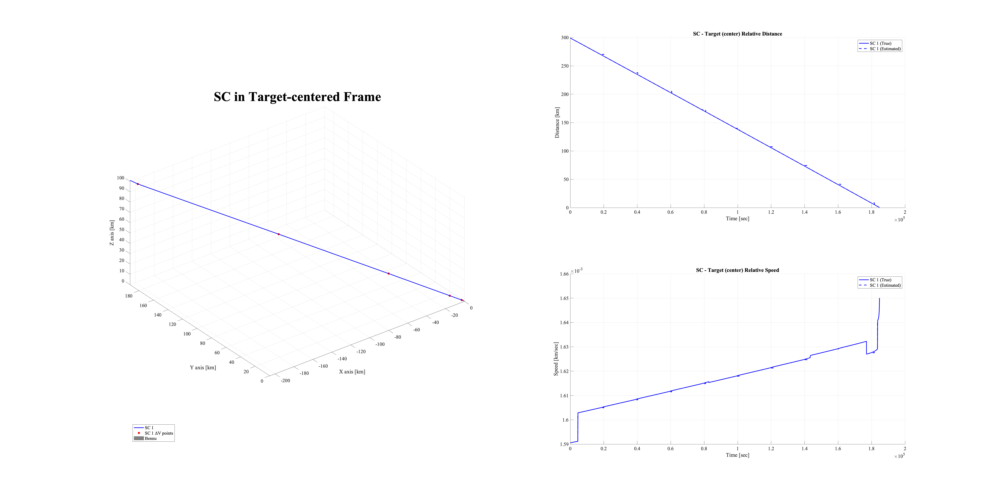

# Multi-Spacecraft Concept and Autonomy Tool (MuSCAT) 

See `Documentation` for detailed description of MuSCAT architecture. 

Also see paper: S. Bandyopadhyay, Y. Kumar Nakka, L. Fesq, S. Ardito, “Design and Development of MuSCAT: Multi-Spacecraft Concept and Autonomy Tool,” AIAA Accelerating Space Commerce, Exploration, and New Discovery (ASCEND), 2024. ([DOI](https://doi.org/10.2514/6.2024-4805))

## Installation Instructions 

### Step 1 

Git clone the repo into your desired folder. Lets say it is `XYZ >`

Then the `muscat` folder is accessed using `XYZ > muscat`

### Step 2 

Ensure that `MuSCAT_Supporting_Files` is in the same parent folder. You can download it from [here](https://www.dropbox.com/s/qokkcj6sn802n7p/MuSCAT_Supporting_Files.zip?dl=0) 

Then the `MuSCAT_Supporting_Files` folder is accessed using `XYZ > MuSCAT_Supporting_Files`

Ensure that you see the following folders inside `MuSCAT_Supporting_Files` folder: `SC_data`, `SB_data`, `Science_points`, `SPICE`, `time`, `Stars`

Download `mice` into the `SPICE` folder from [here](https://naif.jpl.nasa.gov/naif/toolkit_MATLAB.html)

### Step 3

Now we are ready to run the mission files. 

First, ensure that Matlab base directory is `XYZ > muscat`

Second, open in Matlab any of the mission files in `XYZ > muscat > Mission` 

Thrid, click `Run`. 

Finally, the code should run out of the box!  

### Tips with SPICE Installation

On Mac, you need to give permissions to SPICE to use it. 

On Windows, we have found a fresh installation of SPICE is the best option. 

## Report Issues

This software is developed and maintained by:

Saptarshi Bandyopadhyay\
Robotics Technologist\
NASA Jet Propulsion Laboratory\
California Institute of Technology\
Pasadena, CA, USA 

Please mail `Saptarshi.Bandyopadhyay@jpl.nasa.gov` if you face any issues. 

## Simulation Results from MuSCAT

Here are the expected simulation results after executing the `Mission_DART.m` file, which simulates a planetary-defense DART-like spacecraft colliding with the small body Bennu. 

### SC Configuration

### SC ConOps

### SC Orbit

### SC Orbit Control

### SC Attitude Estimator

### SC Attitude Control

### SC Power

### SC Data Handling

### SC Communication

